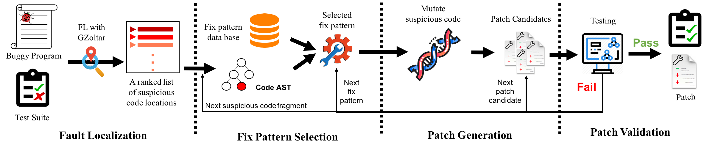

# TBar
Template-based automated program repair


I. Requirement
--------------
 - [Java 1.7](https://www.oracle.com/technetwork/java/javase/downloads/java-archive-downloads-javase7-521261.html)
 - [Defects4J](https://github.com/rjust/defects4j)
 - [GZoltar](https://github.com/SerVal-DTF/TBar/tree/master/lib)

II. Overview of TBar
--------------------




III. Prepare Defects4J Bugs
---------------------------
 1. Download and Install Defects4J.
 - `./installD4J.sh`
 
 2. Check out and compile each bug.
 - `./checkoutD4JBugs.sh`
 It will take a long time to prepare this data. We would like to recommend the data from [zenodo]() directly.
 
 If you fail to install defects4j, checkout or compile defects4j bugs, please reference these [introductions](https://github.com/rjust/defects4j#steps-to-set-up-defects4j).
 
 
 IV. Run TBar
 ------------
 1. Fixing Defects4J bugs with perfect fault localization configuration.
 - `./PerfectFLTBarRunner.sh <Bug_Data_Path> <Bug_ID> <defects4j_Home> <true/false>`
 
 Example: `./PerfectFLTBarRunner.sh D4J/projects/ Chart_1 D4J/defects4j/ false` to fix bug Chart_1 with perfect fault localization configuration.
 
 `./PerfectFLTBarRunner.sh D4J/projects/ Chart_1 D4J/defects4j/ true` tries to fix bug Chart_1 with all possible matching fix patterns.
 
 2. Fixing Defects4J bugs with normal fault localization configuration.
 - `./NormalFLTBarRunner.sh <Bug_Data_Path> <Bug_ID> <defects4j_Home>`
 
 Example: `./NormalFLTBarRunner.sh D4J/projects/ Chart_1 D4J/defects4j/`. 
 
 If it executes failed because of the paths of <Bug_Data_Path> and <defects4j_Home>, please use their absolute paths.
 
 
 V. Structure of the Directories
 -------------------------------
 ```powershell
  |--- README.md               :  user guidance
  |--- D4J                     :  Defects4J information
  |--- FailedTestCases         :  Failed test cases of each Defects4J bug
  |--- lib                     :  GZoltar jar files
  |--- OUTPUT                  :  Generated patches
  |------ FixPatterns          :  Bugs fixed by each fix pattern
  |------ PerfectFL            :  Bugs fixed with perfect fault localization configuration
  |------ NormalFL             :  Bugs fixed with normal fault localization configuration
  |--- src                     :  source code
  |--- SuspiciousCodePositions :  Bug positions localized by GZoltar
  |--- target                  :  binary code
```

----

__ALL__ suggestions are welcomed.
